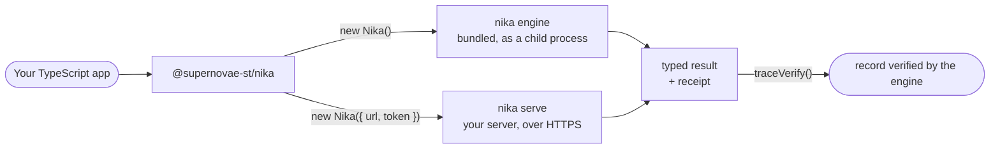

<p align="center">
  <a href="https://nika.sh">
    <picture>
      <source media="(prefers-color-scheme: dark)" srcset="https://nika.sh/brand/nika-logo-dark.svg">
      
    </picture>
  </a>
</p>

<h1 align="center">@supernovae-st/nika</h1>

<p align="center">
  <strong>Run AI workflows from your TypeScript app, and prove what they did.</strong><br>
  Checked before they start, typed when they finish, verifiable afterwards: the Nika engine ships inside the package.
</p>

<p align="center">
  <a href="https://www.npmjs.com/package/@supernovae-st/nika"></a>
  <a href="https://github.com/supernovae-st/nika-client/actions/workflows/ci.yml"></a>
  <a href="https://github.com/supernovae-st/nika/releases/latest"></a>
  <a href="https://docs.nika.sh"></a>
  <a href="LICENSE"></a>
  <br>
  <a href="https://scorecard.dev/viewer/?uri=github.com/supernovae-st/nika-client"></a>
  <a href="https://www.npmjs.com/package/@supernovae-st/nika"></a>
  <a href="https://www.npmjs.com/package/@supernovae-st/nika"></a>
  <a href="https://archive.softwareheritage.org/browse/origin/?origin_url=https://github.com/supernovae-st/nika-client"></a>
</p>

<!-- engine media (this hero and the clips below) is served from supernovae-st/nika main (media/), not from a release tag: re-pin it to the first engine release tag that carries these clips, then on lockstep bumps -->
**Watch a Node app run this README's quick start: checked, run, typed, verified.**

<p align="center">
  <a href="https://raw.githubusercontent.com/supernovae-st/nika/main/media/gifs/typescript-client.optimized.gif">
    
  </a>
</p>
<p align="center"><sub><code>demo.mts</code> from the quick start calls <code>run()</code>. The engine the package bundles checks <code>hello.nika</code>, runs it and records it; the result comes back typed, and <code>traceVerify()</code> prints <code>receipt verified</code>. Captured from this quick start with <code>@supernovae-st/nika</code> 0.120.3 and its bundled engine; the run is a <code>mock/echo</code> rehearsal, and the editor, the lanes and the motion are illustration.</sub></p>

## What is Nika?

Nika turns repeatable AI work into a small file you keep. Say what you
want done, like *"every Monday, pull the action items out of my meeting
notes"*, and Nika writes it as a readable `.nika` workflow. Before
anything runs, `nika check` shows what the workflow will do, which models
and tools it uses, what it is allowed to touch and what it can cost,
without calling a model. You run it when you decide, with the model you
choose, local or cloud, and every run leaves a tamper-evident record you
can verify. One Rust binary, local-first, open source (AGPL-3.0).

| 1 · Say it | 2 · Check it | 3 · Run it | 4 · Prove it |
|:---:|:---:|:---:|:---:|
| Describe the job; Nika writes a `.nika` file | `nika check` audits it before any model is called | `nika run` with the model you choose | `nika trace verify` checks the run's record |

> [!TIP]
> **This package puts steps 2, 3 and 4 in your code.** `check()` audits a
> workflow, `run()` runs it and hands your app a typed result, and
> `traceVerify()` proves what ran. The engine comes inside the npm package:
> on macOS, and on Linux with glibc, there is nothing else to install.

<p align="center">
  <a href="#quick-start">Quick start</a> ·
  <a href="#what-you-get">What you get</a> ·
  <a href="#how-it-works">How it works</a> ·
  <a href="#prove-what-ran">Prove what ran</a> ·
  <a href="#api-reference">API reference</a> ·
  <a href="#install-and-versions">Install and versions</a>
</p>

## What you can build

Anything where your app hands work to AI and needs to trust what happened.
For example:

| You can build | How this package helps |
|---|---|
| **A webhook that runs a workflow per event** | On your `nika serve`, pass the verified payload as `inputs` and the sender's delivery id as `idempotencyKey`: a retried delivery reuses the same job instead of running twice. |
| **A release gate that can say no** | Run the checks in parallel inside one workflow, allow or refuse the deploy from its result, and keep the verified receipt. |
| **A monitor that runs on a schedule** | Declare the cadence on your `nika serve` with `schedule()`, change it safely by revision, and reconnect after a restart. |
| **An incident assistant you can stop** | Follow each step with `run.events()` and stop it cleanly with `run.cancel()`. |

Each row is a tested example project in
[`gauntlet/projects-depth`](https://github.com/supernovae-st/nika-client/tree/main/gauntlet/projects-depth):
a fresh Node app that installs this package from its npm tarball and runs
against the real engine.

## Quick start

You need Node.js 22 or newer, on macOS or Linux (glibc). The TypeScript file
in step 3 runs as is on Node.js 22.18 or newer; on an older 22.x, name it
`demo.mjs` and remove `<{ greeting: string }>`.

**1 · Install the package.** npm brings the matching engine with it, and the
`nika` command at `./node_modules/.bin/nika`.

```sh
npm install @supernovae-st/nika
./node_modules/.bin/nika key init   # once per machine: the engine will sign each run's record
```

**2 · Write a workflow.** Save this as `hello.nika`:

```yaml
nika: hello
model: mock/echo
permits: {}
tasks:
  greeting:
    infer:
      prompt: "Say hello from the Nika SDK."
      max_tokens: 32
outputs:
  greeting: ${{ tasks.greeting.output }}
```

A `.nika` file is a readable workflow: the model to use, what the workflow may
reach, run and read (its *permits*; `permits: {}` grants no file, network,
command or tool access), its tasks and its outputs. `mock/echo` is the
engine's offline rehearsal model: it echoes the prompt back, with no key and
no network.

<details>
<summary><b>Let the engine write the file, or audit it before anything runs</b></summary>

```sh
./node_modules/.bin/nika compile --list             # the ready-made skeletons
./node_modules/.bin/nika compile hello hello.nika   # writes a starter hello.nika (its task asks for French)
./node_modules/.bin/nika check hello.nika           # the audit, without calling a model
```

`nika check` is the static audit that runs before any model is called: what
the workflow will do, which models and tools it uses, what it may touch and
what it can cost. An excerpt of its report for the file above, on engine
0.120.3:

```text
nika check · hello.nika
 ✔ PLAN     1 wave · 1 task · max parallelism 1
      wave 1 greeting (infer · mock/echo)
 ✔ ACCESS   mock/echo → mock (mock · local · observed) · mock · never dials · nothing to judge
 ✔ COST     $0.0000 – $0.0000 worst-case output ceiling · prompts, exec + mcp unpriced · prices 2026-07-28
 …
 ✔ PERMITS  literal + const: args fit the boundary · computed programs, paths + symlinks are the RUN's verdict
 ✔ TRIFECTA no lethal trifecta over the declared permits: without a human gate
 ✔ JOURNEY internal · 0 sources · 0 destinations · 1 model endpoint · no secret reaches an external destination
 ✔ audited · 1 task · 1 wave · permits {} · est out ≤$0.0000 · 0 hints · risk low
 layers · valid ✔ · access ready ✔ · capacity fit ✔ · run ready ✔
```

▶ [Watch compile, check, run and verify on the command line](https://raw.githubusercontent.com/supernovae-st/nika/main/media/gifs/full-loop.optimized.gif):
the same loop your code drives, all four commands captured from the real
CLI, the run a `mock/echo` rehearsal.

</details>

**3 · Run it and verify it from TypeScript.** Save this as `demo.mts`:

```ts
import { Nika, isNikaRunSucceeded } from '@supernovae-st/nika';

const nika = new Nika({ cwd: process.cwd() });

// The engine checks the file first: a workflow it refuses throws here and never starts.
const run = await nika.run<{ greeting: string }>('hello.nika', { maxCostUsd: 0 });
const result = await run.result();

// A failed run is data you read, not an exception.
if (!isNikaRunSucceeded(result) || !result.receipt) {
  console.error(result.status, result.error?.code, result.error?.message);
  process.exit(1);
}
console.log(result.outputs?.greeting);

// Ask the engine to verify the run's tamper-evident record.
const proof = await nika.traceVerify(result.receipt);
console.log(proof.verified ? 'receipt verified' : `not verified: ${proof.reason}`);
```

```sh
node demo.mts
```

```text
mock(echo) · Say hello from the Nika SDK.
receipt verified
```

`maxCostUsd: 0` gives the run a budget of zero dollars for paid model calls:
the engine refuses to start a run whose paid calls would cost more, and never
blocks local or mock models. The `mock(echo) ·` prefix marks a rehearsal, not
a model's answer. When you are ready, set `model:` to one that
`./node_modules/.bin/nika catalog` lists, such as `ollama/llama3.2:3b` for a
local model; for a paid cloud model, raise `maxCostUsd` to the budget you
accept.

> [!NOTE]
> **Seeing `not verified: receipt_mismatch`?** The run succeeded, but this
> machine had no signing key, so the engine could not seal the run's record.
> Run `./node_modules/.bin/nika key init` once, then run the demo again.

## What you get

<table>
  <tr>
    <td width="33%" valign="top"><b>Checked before it runs</b><br>The engine audits every workflow first. <code>run()</code> refuses a red file with the engine's code and findings, and nothing starts.</td>
    <td width="33%" valign="top"><b>The engine included</b><br>npm installs the exact engine this version was tested with. It never picks up a <code>nika</code> from your <code>PATH</code>.</td>
    <td width="33%" valign="top"><b>Typed, honest results</b><br>Type your outputs with <code>run&lt;Outputs&gt;()</code>. A failed or paused run comes back as data, in the engine's own words.</td>
  </tr>
  <tr>
    <td valign="top"><b>Live progress</b><br><code>run.events()</code> streams one vocabulary on every transport: <code>run.started</code>, <code>task.completed</code>, <code>run.settled</code>…</td>
    <td valign="top"><b>A hard budget</b><br><code>maxCostUsd</code> caps what a run on your machine may spend on paid models. Local and mock models are never blocked.</td>
    <td valign="top"><b>Your data, taken literally</b><br><code>inputs</code> carry strict JSON the engine type-checks. Nothing is read from your environment or evaluated.</td>
  </tr>
  <tr>
    <td valign="top"><b>A receipt you can verify</b><br>Every run keeps a trace, a tamper-evident record of what happened. <code>traceVerify()</code> has the engine check your receipt against it.</td>
    <td valign="top"><b>Local or server, same code</b><br><code>new Nika({ url, token })</code> drives your own <code>nika serve</code>: durable jobs, safe retries, recovery, schedules.</td>
    <td valign="top"><b>The model you choose</b><br>Local (Ollama, llama.cpp, LM Studio, vLLM…) or cloud (Mistral, OpenAI, Anthropic, Gemini…). <code>nika catalog</code> lists them.</td>
  </tr>
</table>

**Watch the check catch two mistakes before anything runs.**

<p align="center">
  <a href="https://raw.githubusercontent.com/supernovae-st/nika/main/media/gifs/static-check-fix.optimized.gif">
    
  </a>
</p>
<p align="center"><sub><code>nika check</code> finds two defects, the fix lands, the re-check is clean, and no model is called. Your code gets the same verdict from <code>check()</code> and <code>run()</code>. Every line is captured from the real CLI.</sub></p>

- **The file is the boundary.** A workflow lists what it may reach in
  `permits:`. The check catches the task that reaches past it.
  ▶ [Watch the check catch an escape](https://raw.githubusercontent.com/supernovae-st/nika/main/media/gifs/permits-audit.optimized.gif)
- **Failures you planned for.** `on_error: recover` absorbs a missing live
  feed: the run finishes, the output says stale, the trace records the
  failure. ▶ [Watch a missing feed absorbed](https://raw.githubusercontent.com/supernovae-st/nika/main/media/gifs/on-error-recover.optimized.gif)

## How it works



- **On your machine.** `new Nika()` starts the engine that came with the
  package, as a child process in your working directory. It uses `bin` or
  `NIKA_BIN` instead when you set one (an absolute path), and never a `nika`
  found on your `PATH`.
- **On your server.** `new Nika({ url, token })` talks to a `nika serve` you
  run: the same engine, holding durable jobs and schedules. Plain HTTP is
  accepted only to a loopback host.
- **The engine decides.** It parses, audits, runs and records every workflow.
  This package carries its answers to your code, typed. It never parses the
  file itself or re-implements the proof.

**Watch the same engine audit a real job, then run it on a local model.**

<p align="center">
  <a href="https://raw.githubusercontent.com/supernovae-st/nika/main/media/gifs/nika-hero.optimized.gif">
    
  </a>
</p>
<p align="center"><sub>The same engine from the command line, on a real job: the audit first, then a run on a local model that writes a meeting's action items as typed JSON. Both are captured from the real CLI; the run uses a real local model (<code>ollama/llama3.2:3b</code>).</sub></p>

## Prove what ran

Every run leaves a *trace*: a tamper-evident, hash-chained record of what
happened, written to `.nika/traces/` in the engine's working directory. The
run hands your code a receipt, and `traceVerify(receipt)` asks the engine to
check the trace against it. With a signing key (`nika key init`), the engine
also seals the trace: it signs the record when the run ends.

**Watch the engine verify a run's record, then catch one changed byte.**

<p align="center">
  <a href="https://raw.githubusercontent.com/supernovae-st/nika/main/media/gifs/trace-proof.optimized.gif">
    
  </a>
</p>
<p align="center"><sub>The chain reads back intact; in a copy with one changed byte, verify stops at the next line (BROKEN, exit 2). <code>traceVerify()</code> asks the engine for this same check on your run's trace, then checks your receipt against the engine's evidence. An unsigned <code>mock/echo</code> rehearsal captured from the real CLI; the scan is an illustration.</sub></p>

| On this machine | `traceVerify()` answers |
|---|---|
| A signing key exists | `{ verified: true, verdict: 'verified' }`: the record is sealed and matches the receipt |
| No signing key yet | `{ verified: false, verdict: 'invalid', reason: 'receipt_mismatch' }`: the run still succeeded, but its record is unsealed |

Both rows were measured with the quick-start file on engine 0.120.3. A trace
can hold model outputs and file contents, so keep `.nika/traces/` out of git.

> [!IMPORTANT]
> A verified receipt proves that the run's record is intact and matches the
> receipt. It does not prove that the workflow was right, or that a person
> read its output. The
> record is tamper-evident, not tamper-proof. And `receipt_mismatch` is also
> the engine's answer for a tampered or edited receipt: do not read every one
> as "just unsigned".

<details>
<summary><b>Admitted, executed, sealed: three different facts</b></summary>

| Fact | How you see it | What it is not |
|---|---|---|
| **Admitted** | `run()` resolves with a `NikaRun`. A workflow the engine refuses makes `run()` throw `NikaOperationError` (`NIKA-SEC-004`, `NIKA-PARSE-005`, `NIKA-1708`…), and no run exists. `check()` shows the same verdict without running: `clean: false` and the findings. | Not a successful execution. |
| **Executed** | `run.result()` and `isNikaRunSucceeded(result)`. An admitted failure is data (`status: "failed"`). A human gate is `paused` (a `run.waiting` event), not success. | Not proof that the record is sealed. |
| **Sealed** | `result.receipt.sealed` and `traceVerify(receipt)`. Tamper-evident, not tamper-proof; not replayed unless you ask the CLI (`--replay`); not anchored without a sidecar. | Not "the workflow was correct", and not "a person read the output". |

Measured on engine 0.120.3 with the quick-start file: `run.events()` yields
the same six events with or without a signing key. With a key, the receipt
reads `sealed: true` and `traceVerify` returns
`{ verified: true, verdict: 'verified' }`. With an empty `HOME` and no key,
the same run **succeeds** with `sealed: false`, and `traceVerify` returns
`{ verified: false, verdict: 'invalid', reason: 'receipt_mismatch' }`, while
the engine's own `nika trace verify` still calls the journal chain OK and
unsealed. The event count that command prints counts journal entries; it is
not the number of `run.events()`.

</details>

<details>
<summary><b>What a receipt carries, and verifying a <code>nika serve</code> job</b></summary>

Pass a receipt back unchanged: the package never reads a trace or does
cryptography itself. It asks the engine.

- **A local run's receipt** carries the proof fields (`trace_path`,
  `chain_head`, `chain_len`, `sealed`) with `trace_id`, `execution_id` and
  `snapshot_digest`. `traceVerify` runs the engine's verifier on that trace,
  then checks that the receipt matches the engine's evidence for it:
  `verified: true` means both held.
- **A `nika serve` job's receipt** carries the job's identity (`job_id`,
  `execution_id`, `trace_id`, `snapshot_digest`, `origin`) and, on engine
  0.120.3, the `chain_head`. Store it with the job id. `traceVerify` asks the
  server (`GET /v1/jobs/{id}/trace/verify`) for its verdict on the journal it
  wrote for that job. The verdict is the CLI's word, in lower case: `ok` (the
  chain is intact but unsigned, with `reason: "unsealed"`), `sealed`,
  `anchored` or `replayed` hold; `incomplete`, `tampered` and `broken` do not;
  `unavailable` means the server has no journal for the job (refused before
  its first event, still queued, or a backend that keeps none). The package
  sets `verified: true` only for a verdict that holds **and** names this
  receipt's `trace_id`.

Over HTTP, `verified: true` can therefore mean "intact but unsigned": read
`proof.verdict` when you need to know that a job's record is sealed. On
engine 0.120.3 a server with a signing key answered `sealed`, and one
without answered `ok`.

</details>

<details>
<summary><b>Signing keys</b></summary>

Run-signing keys belong to the engine: `nika key init` mints one,
`nika key trust` prints its public key and fingerprint to enroll on other
machines, and `nika key rotate` retires it and mints a new one (records signed
with a retired key stay verifiable). The engine prefers the OS keychain and
falls back to `0600` files under `~/.nika/keys/`. In CI, give it an explicit
pair through `NIKA_RUN_KEY_FILE` and `NIKA_RUN_PUB_FILE`.

Store receipts and public trust material in your app. Never copy a private run
key into SDK configuration, source control, workflow inputs or an HTTP
request.

</details>

## API reference

Everything goes through one class, `Nika`, and the run handle it returns.
Create the client once: it drives the bundled engine by default, or a
`nika serve` when you give it a `url`.

| `Nika` method | What it does | Resolves with |
|---|---|---|
| `run(workflow, options?)` | Checks the workflow, then starts it | a `NikaRun` once the engine admits it; rejects with `NikaOperationError` when the engine refuses |
| `check(workflow, options?)` | Audits a workflow without running it | the engine's report: `clean` and the findings |
| `traceVerify(receipt, options?)` | Has the engine verify a run's record | `NikaTraceVerifyResult`: `verified`, `verdict`, `reason` |
| `compile(request, options?)` | Writes or edits a candidate workflow, without running it | `NikaCompileOutcome` |
| `attachRun(id, options?)` | Picks a server job back up after a restart | a `NikaRun` |
| `listWorkflows()` · `workflow(name)` | Lists or describes the workflows a server serves | names · metadata |
| `schedule(workflow, options)` · `scheduleStatus(id)` | Creates, changes or reads a schedule on a server | the applied schedule · its status |

| `NikaRun` member | What it gives you |
|---|---|
| `run.id` | The run's id: the server's durable job id over HTTP, a throwaway id on a local engine |
| `run.events(options?)` | The run's events as they happen, or replayed from the start |
| `run.result()` | The final result, settled once; a failed run resolves, it does not throw |
| `run.status()` | The current status without waiting (server runs only) |
| `run.cancel()` | Asks the engine to stop the run; every call returns the same request |
| `run.done` | The same promise as `run.result()`, kept for older code |

Every member is bound to its run, so you can pass it around:
`const { events, result } = run`. The handle only observes, settles, reports
and cancels its run; checking, proof, catalogs and authoring stay on `Nika`.

Your code reads the same on both transports: `check`, `run`, `events`,
`cancel` and `traceVerify` keep their names and meaning, and only the
constructor changes. `schedule` and `scheduleStatus` need a server, because a
short-lived local process cannot honestly own a schedule.

<details>
<summary><b>Constructor options</b></summary>

```ts
const local = new Nika({ cwd: process.cwd() });
const remote = new Nika({ url: 'https://nika.example.com', token });
```

| Option | Default | What it does |
|---|---|---|
| `cwd` | the current working directory | Where the local engine runs and resolves workflow paths; for a server client, where a local file is captured |
| `bin` | `NIKA_BIN`, then the bundled engine | An absolute path to the engine to use |
| `eventBufferSize` | 4096 | How many of a run's most recent events a late view can be given (see *Watch a run*) |
| `machineBufferBytes` | 64 KiB | The size limit for one engine frame or diagnostic |
| `url` | none | A `nika serve` base URL; setting it switches to HTTP |
| `token` | required with `url` | The bearer token from the server's `--token-file` |
| `allowInsecureHttp` | `false` | Allows plain `http://`, and only to a loopback host |
| `requestTimeout` | `30000` (30 s) | The time limit for an HTTP admission request, in milliseconds |
| `fetch` | `globalThis.fetch` | A custom, standards-compatible `fetch` |

`token`, `allowInsecureHttp`, `requestTimeout` and `fetch` require `url`;
passing them to a local client throws `NikaConfigurationError`.
`nika.transportKind` tells you which transport a client uses:
`'native-process'` or `'http'`.

</details>

<details>
<summary><b>Check a workflow: <code>check()</code></b></summary>

You do not need `check()` before `run()`: the engine checks on every run, and
a red file never becomes a run. Use `check()` to show the audit without
running anything, for example in a CI step or an editor.

```ts
const report = await nika.check('hello.nika', { nativeStrict: true });
console.log(report.clean, report.exitCode);
```

- **On a local engine** you get the engine's whole report: `clean`,
  `exitCode` and its `findings[]`. Options: `model` (check against another
  model), `nativeStrict` (the engine's `--native-strict` audit) and `signal`
  (stops this check only).
- **On a server, by served name**, you get the server's short answer:
  `clean: true`, or its typed refusal with `clean: false`. The package never
  invents findings or an exit code. An explicit local path (`./hello.nika`)
  is captured locally and returns the engine's findings and exit code.
  `model` and `nativeStrict` are refused over HTTP with a typed error.

The same audit, for humans, is `./node_modules/.bin/nika check hello.nika`.

</details>

<details>
<summary><b>Read the result</b></summary>

```ts
import { Nika, isNikaRunSucceeded } from '@supernovae-st/nika';

const run = await new Nika().run<{ answer: number }>('flow.nika');
const result = await run.result();
if (isNikaRunSucceeded(result)) {
  console.log(result.outputs?.answer); // outputs stay typed and optional
} else {
  console.error(result.status, result.error?.code, result.error?.message);
  process.exitCode = 1;
}
```

| `result.status` | What happened |
|---|---|
| `succeeded` | The run finished. Its `outputs` are on the result, when the workflow declares any. |
| `failed` | The engine admitted the run and it failed. `result.error` carries the engine's `code`, `message` and, when one task failed, its `task`. |
| `paused` | A human gate holds the run. It is neither a failure nor a finished run. |
| `cancelled` | The run was cancelled. |
| `interrupted` | The engine lost the execution; how it would have ended is unknown. |

> [!WARNING]
> An admitted failure **resolves**: `run.result()` does not throw for a failed
> workflow. A `try { await run.result() } catch {}` alone never catches one,
> so a CI job or an app must read `result.status`, or call
> `isNikaRunSucceeded(result)`, and treat anything but `succeeded` as its own
> failure. Otherwise a red run passes silently.

`run.result()` rejects only for transport, protocol, configuration and
compatibility problems, with typed errors (see *Errors*). None of those says
the run failed: it may still be running.

`isNikaRunSucceeded` (published since 0.120.0) returns `false` for paused,
failed, cancelled and interrupted runs. It only reads the engine's status and
never fills in missing outputs. A paused run arrives as a `run.waiting` event,
never as `run.settled`, and `result.status` keeps the engine's word, `paused`:
show it as waiting, and never let a CI job pass it as success.

On engine 0.118 and newer, `result.settlement` also carries the engine's own
account of the ending: its `cause` (`normal`, `human_gate`, `task_failed`,
`budget`, `operator`…), the task tally, the elapsed time and the spend with
its pricing qualifier. An unknown cost is never reported as zero.

</details>

<details>
<summary><b>Pass your app's data: <code>inputs</code></b></summary>

`inputs` fills the workflow's declared `inputs:` by name, with the same
meaning on both transports:

```ts
const run = await nika.run('support-triage.nika', {
  inputs: { ticketId: '42' },
  // idempotencyKey: `triage-${ticket.id}`, // HTTP only
});
```

**Values are strict JSON and stay literal.** `'42'` stays a string and `42` a
number. `'@env:HOME'` and `'${{ tasks.x.output }}'` are plain text: never read
from the environment, never evaluated. Nothing is converted to the declared
type.

**The engine judges them before any run exists.** An undeclared key
(`unknown_input`), a value that does not fit its declared type
(`input_type_mismatch`) or a missing required input (`NIKA-1708`) makes
`run()` reject with a `NikaOperationError` carrying that code, `status: 3` on
a local engine and `status: 422` over HTTP. The values you pass are recorded
with `api-caller` provenance; declared defaults keep `file`.

**The package refuses what JSON would silently lose**, before it starts or
sends anything: `undefined`, a function, a symbol, a bigint, `NaN` or
`Infinity`, a cycle, a class instance (a `Date`, a `Map`), an object whose
prototype only pretends to be plain, an array hole, an accessor. That is a
`NikaConfigurationError` naming the path (`inputs.ticketId is undefined`),
never the value. None of your code runs while the map is judged: no getter is
called, and a `Proxy` is refused before it is read. The serialized map is
limited to 1 MiB on both transports. Do not put a secret in `inputs`.

**The engine must advertise the channel**, and the package checks before
admission:

- Local: `inputsLiteral` in `nika --sdk-identity`. The values travel on the
  engine's stdin (`nika run --inputs-json -`), so they never appear in a
  process listing.
- Server: `jobInputs` in `GET /health`, for a workflow run by its served
  name. A snapshot of a local file (`./flow.nika`) freezes its inputs, so an
  HTTP run of a local path refuses `inputs`, even an empty map.

Engine 0.120.3 advertises both. An engine without the capability makes `run()`
reject with `NikaCompatibilityError` (`capability: 'inputsLiteral'` or
`'jobInputs'`) and nothing runs. The SDK never falls back to `--var`. A server
that merely answers 202 has agreed to nothing: one older than this channel
accepts the field and ignores its values.

`vars` is deprecated. It remains the local `--var KEY=VALUE` operator
channel, unchanged: the engine reads `@env:NAME` from its environment and
converts text to the declared type, so it cannot carry literal values and has
no HTTP form. Passing `inputs` and `vars` together rejects `run()`; they are
never merged.

</details>

<details>
<summary><b>Watch a run: <code>run.events()</code></b></summary>

`run.events()` yields `NikaRunEvent`s: a lifecycle `kind` that means the same
on both transports, plus the exact engine frame on `event.raw`.

```ts
for await (const event of run.events()) {
  switch (event.kind) {
    case 'run.started': break;
    case 'task.completed': console.log('done:', event.task); break;
    case 'task.failed': console.error(event.task, event.error?.code); break;
    case 'run.waiting': console.log('a human gate holds the run'); break;
    case 'run.settled': console.log('ended:', event.status); break;
    case 'run.interrupted': console.warn('the engine lost this execution'); break;
    default: break; // new kinds may come: event.raw.kind names the frame
  }
}
```

For the quick-start file on a local engine you get six events:
`run.started`; `task.scheduled`, `task.started` and `task.completed` for the
task `greeting`; one `engine.event` (the engine's `workflow_completed`); then
`run.settled` with `succeeded`. That holds with or without a signing key
(engine 0.120.3). A `nika serve` run of the same file yields two,
`run.started` and `run.settled`: the server streams no per-task frames, and
the package never invents one.

| `event.kind` | Local engine frame (`event.raw.kind`) | Server frame (`event.raw.kind`) |
|---|---|---|
| `run.started` | `workflow_started` | `execution.started` |
| `task.scheduled` · `task.started` · `task.completed` · `task.failed` | `task_scheduled` · `task_started` · `task_completed` · `task_failed` | none: the server streams no per-task frame |
| `run.waiting` | `run_settled` carrying `paused` | `execution.settled` carrying `paused` |
| `run.settled` | `run_settled` carrying `succeeded` · `failed` · `cancelled` | `execution.settled` carrying `succeeded` · `failed` · `cancelled`; `execution.cancelled` carrying `cancelled` only; `execution.refused` carrying `failed` only |
| `run.interrupted` | `workflow_interrupted` carrying `interrupted` | `execution.interrupted` · `interrupted` carrying `interrupted` |
| `run.sealed` | `run_sealed` | none |
| `engine.event` | every other frame (`workflow_completed`, `workflow_paused`, `permit_checked`…) | every other frame, including a `null` or future kind |

`event.status` is always the engine's own word (a waiting run reads
`paused`). `event.task` is the task a `task.*` frame named. `event.error` is
the failure a `task.failed` frame or a `failed` settlement named; no other
event carries one. `event.sequence` is the server's replay cursor and exists
only over HTTP. An `engine.event` carries only its cursor and `raw`, never a
`status`.

The package names a fact only when the engine wrote it, for a (kind, status)
pair the table lists. The engine's state word decides and is never assumed: an
absent, null, future or still-running status stays an `engine.event`, and so
does a frame that contradicts itself (`execution.refused` carrying
`succeeded`, say). `event.raw` still holds that frame, and `run.result()`
still reads the state the engine wrote. The projection keeps no state between
frames, removes no duplicates and never makes up an event: transports differ
in how many events they send, never in their names.

`run.waiting` is not `run.settled`: a human gate holds a run that can resume,
neither failed nor done. `run.interrupted` is the engine reporting that it
lost an execution; it has nothing to do with the thrown
`NikaObservationInterrupted`, which means this client lost its view of a run
that may still be running.

**A view opened late.** You can read the result first and the events after:

```ts
const run = await nika.run('wide.nika');
const result = await run.result();          // first the result,
for await (const event of run.events()) {}  // then every event the run saw
```

A late view gets every event the run kept, or it is refused; it is never
handed a shortened history. A run keeps its most recent `eventBufferSize`
events, **4096 by default** (256 up to 0.118.7). For scale, measured on engine
0.118.7: a clean run of N independent `mock/echo` tasks wrote `3N + 3` frames
(1 task: 6, 90 tasks: 273). That is one fixture, not a law: a `nika:wait` or
a `nika:assert` task added a `permit_checked` frame, a failed task writes
`task_failed`, and retries, agents and `for_each` were not measured. Count
your own run: `error.observed` below gives the number. A `nika serve` job was
measured at two frames, so the bound matters on a local engine.

The bound is finite on purpose. Each frame is capped by `machineBufferBytes`
(64 KiB), so a run's kept history holds at most
`eventBufferSize × machineBufferBytes` of frame text: 256 MiB at the defaults,
where 256 events gave 16 MiB. That is arithmetic, not a measurement (the 273
measured frames totalled 0.15 MiB, 1,501 bytes at most), and it bounds the
history only: events your code holds, other open views and other runs add
their own. Nothing here is a claim about heap or process memory. If the
ceiling matters to you, set `eventBufferSize` yourself: an explicit value is
kept exactly, so `eventBufferSize: 256` behaves as it always did.

Past the bound, the run still runs and `run.result()` still resolves. Only a
view is refused, with `NikaEventBufferOverflowError`, whose `reason` names the
bound it hit:

| `error.reason` | What happened | What to do |
|---|---|---|
| `replay_truncated` | The view opened after the run produced more events (`error.observed`) than it can be given (`error.limit`); `error.retained` is how many the run still holds | If `retained === observed`, nothing is lost: open the view with `bufferSize >= observed`. Otherwise the early events are gone from this process: set `eventBufferSize >= observed` for the next run, or watch it live |
| `live_backpressure` | A live view fell more than `error.limit` events behind | Read faster, or raise that view's `bufferSize`; other views and the result are unaffected |

```ts
try {
  for await (const event of run.events()) render(event);
} catch (error) {
  if (error instanceof NikaEventBufferOverflowError && error.reason === 'replay_truncated') {
    // The run is fine. Its history is longer than this view can replay.
    console.warn(`${error.observed} events, ${error.retained} retained; run ${result.status}`);
  } else throw error;
}
```

Neither refusal skips an event, and neither is about the run.
`error.observed` is a count taken when the view opened. The engine's journal
stays the source of truth for a local trace (`receipt.trace_path`,
`traceVerify`): a late `run.events()` only replays what this process saw, and
the package reads no journal to extend it. Over HTTP the server holds the
job: recover there with `attachRun(id, { lastEventId })`.

</details>

<details>
<summary><b>Cancel a run</b></summary>

```ts
const run = await nika.run('slow.nika');
const cancellation = await run.cancel();
const result = await run.result();

console.log(cancellation.accepted, cancellation.status, result.status);
```

`run.cancel()` is idempotent: every call returns the same request. An
`AbortSignal` you pass to `check`, `events` or `traceVerify` stops only that
request or view; it never cancels the run.

- **Local engine.** The package signals the engine process. The result is
  whatever the engine then records: `cancelled` when it settled the request,
  `interrupted` when the process ended without a settlement. On engine
  0.120.3, cancelling a run waiting in a `nika:wait` task printed
  `true cancellation_requested cancelled`.
- **`nika serve`.** A running job answers 202,
  `{ accepted: true, status: 'cancellation_requested' }`, and `run.result()`
  settles on the ending the server records: `cancelled`, `succeeded`,
  `failed`, or `interrupted` once its grace period expired. A job cancelled
  before its execution started settles on the reply itself (200,
  `status: 'cancelled'`). A job that already ended replays its result with
  `accepted: false` and `status: 'already_settled'`.

</details>

<details>
<summary><b>Run on your server: <code>nika serve</code></b></summary>

`nika serve` is the same engine running as a server: it holds durable jobs
and schedules, and your app reaches it over HTTP. In the project folder you
need three things.

1. **A project file.** The server refuses to start without one; a minimal
   `nika.yaml` is enough:

   ```yaml
   nika: my-project
   ```

2. **A private token file.** The server refuses one that is not mode `0600`:

   ```sh
   mkdir -p .nika
   umask 077
   openssl rand -hex 24 > .nika/serve.token
   chmod 600 .nika/serve.token
   ```

3. **The server**, serving the workflows under the current folder:

   ```sh
   ./node_modules/.bin/nika serve \
     --bind 127.0.0.1:8787 \
     --workflows . \
     --token-file .nika/serve.token \
     --state-root .nika/serve
   ```

Then connect from Node:

```ts
import { readFile } from 'node:fs/promises';
import { Nika } from '@supernovae-st/nika';

const token = (await readFile('.nika/serve.token', 'utf8')).trim();
const nika = new Nika({
  url: 'http://127.0.0.1:8787',
  token,
  allowInsecureHttp: true, // plain HTTP, accepted only to a loopback host
});

const report = await nika.check('hello.nika');
const run = await nika.run('hello.nika', {
  idempotencyKey: 'hello-2026-09-28', // store it before the call; reuse it on retry
});
for await (const event of run.events()) {
  console.log(event.sequence, event.kind, event.status);
}
console.log(report.clean, await run.result());
```

After `new Nika(...)`, the code is the same as for a local engine.

- **Workflows by name.** `hello.nika` or `daily/report.nika` is a name the
  server resolves in its `--workflows` folder: `check()` and `run()` send the
  name, so your app needs no local engine and no local file.
  `listWorkflows()` lists the names; `workflow(name)` describes one.
- **Your local file instead.** Pass an explicit path such as `./hello.nika`:
  the local engine captures an immutable snapshot of the file, and the
  package sends its exact bytes and checks the server's acknowledgement. Only
  this needs a local engine (`bin`, `NIKA_BIN` or the platform package).
- **Events.** A server run yields `run.started` then `run.settled`, in the
  same words as a local run, but no per-task events. `event.sequence` is the
  server's replay cursor.

**Retries without duplicates.** Over HTTP, `run()` needs an `idempotencyKey`
you own. Store a unique key for each business operation before you call. If
the response is lost or times out, retry the same request with the same key:
you get the same job. A new key can start a second job. A local run refuses
the key. Keys cover the server's whole `--state-root` and do not expire
today, so make them globally unique and never reuse one for another workflow.

**Recovery after a restart.** A run handle belongs to its process and is not
serializable. Store the **job id** (`run.id`) and the last `event.sequence`
you fully processed, then pick the job back up without submitting it again:

```ts
const recovered = await nika.attachRun(saved.jobId, {
  lastEventId: saved.lastEventSequence,
});
for await (const event of recovered.events()) {
  await saveApplicationCheckpoint(recovered.id, event.sequence);
}
console.log(await recovered.result());
```

`attachRun` is the one way back in, and it returns a full `NikaRun`. Only a
server's job id is durable: a local `run.id` is a throwaway id of the SDK
process, appears in no journal, and `attachRun` refuses it.

When observation loses the connection past its retry budget, the package
makes one last durable read. A finished job settles `run.result()` from the
server's record; a job still running rejects with
`NikaObservationInterrupted`, whose `lastSequence` is the `lastEventId` to
resume from. That error is about this client's view, not the run, which may
still be running. The engine's own `interrupted` state is different: a server
that lost an execution reports a `run.interrupted` event and
`result.status === 'interrupted'`, as data.

**Connection rules.** Plain HTTP is accepted only to a loopback host
(`localhost`, `127.0.0.0/8`, `[::1]`), and only with
`allowInsecureHttp: true`; every other host needs HTTPS, so the token never
leaves the machine in plaintext. The URL may not carry credentials, a query
or a fragment, and the token must be 32–512 visible ASCII bytes. To serve
other machines, start the server with `--allow-remote` behind a reverse proxy
that terminates TLS (the server does not), and connect with `https://`.

**What a server run does not take.** `inputs` work by served name when the
server advertises `jobInputs` (see *Pass your app's data*). There is no
per-run `model`, `vars` or `maxCostUsd` over HTTP: the package refuses them
with a typed error instead of dropping them, and the server applies its own
default spending ceiling. Bound a server run through its workflow: its model
and `max_tokens`. A server `check()` refuses `model` and `nativeStrict` the
same way.

</details>

<details>
<summary><b>Schedules on your server</b></summary>

A schedule belongs to a server. A local client refuses `schedule` and
`scheduleStatus`, because a short-lived process cannot own schedule state.

```ts
const applied = await nika.schedule('hello.nika', {
  id: 'weekday-hello',
  when: { kind: 'cadence', expression: 'TZ=Europe/Paris 0 9 * * 1-5' },
  maxCostUsd: 0.01,
  missed: 'catch-up-once',
  overlap: 'skip',
  afterSkip: 'next_slot',
});

const status = await nika.scheduleStatus('weekday-hello');
console.log(applied.changed, status.next, status.lastDecision);

// Pause it: send the whole declaration again, with the revision you read.
await nika.schedule('hello.nika', {
  id: 'weekday-hello',
  when: { kind: 'cadence', expression: 'TZ=Europe/Paris 0 9 * * 1-5' },
  maxCostUsd: 0.01,
  missed: 'catch-up-once',
  overlap: 'skip',
  afterSkip: 'next_slot',
  revision: status.revision,
  active: false,
  pauseReason: 'maintenance',
  pauseUntil: '2026-12-01',
});
```

- **Revisions.** A create is sent with `If-None-Match: *`; an update needs
  the exact prior revision (`If-Match`). Revisions are the engine's opaque
  `sha256:<64 lowercase hex>` values: never make one up. A writer holding a
  stale revision gets a typed `NikaOperationError` (`schedule_conflict`,
  HTTP 412) that carries the current revision.
- **Expressions.** A cron expression carries its time zone:
  `TZ=<IANA zone> …`. `tolerance` uses `m/k`. Timed hash jitter is not
  supported yet and is refused.
- **Pausing.** `active: false` needs a `pauseReason` and a `pauseUntil`
  calendar date (`YYYY-MM-DD`).
- **Overlap.** `afterSkip` needs `overlap: "skip"`, the engine's default, so
  leaving `overlap` out works too.
- **Budget.** A schedule's `maxCostUsd` must be a positive number: `0` is
  refused, where a local `run()` accepts it.
- **Older state.** Treat any `status.finding` recovered from older state as
  not runnable. The engine refuses a new active declaration it cannot plan
  before storing it. The planning facts in a status are the engine's, and new
  ones may appear.

</details>

<details>
<summary><b>Write or edit a workflow: <code>compile()</code></b></summary>

`compile()` asks the engine for a candidate workflow and runs nothing. On
this version it resolves the exact skeleton names `nika compile --list` shows
(`hello` included) and edits the constants of an existing workflow. Free-text
intent comes back `incomplete`, and nothing is written.

```ts
const candidate = await nika.compile({
  intent: 'classify-and-route',
  answers: { 'const.request': 'An outage affects support customers.' },
}, { timeoutMs: 15_000 });

// Every outcome is data: ready, incomplete and refused alike.
console.log(candidate.status, candidate.questions, candidate.diagnostics);
if (candidate.ready && candidate.candidate !== null) {
  const edited = await nika.compile({
    workflow: candidate.candidate,
    change: { set_constant: { name: 'request', value: 'One customer is affected.' } },
  });
  console.log(edited.candidate);
}
```

- **Edits** also accept text, such as `Set const.request to "One customer"`.
  Answers and values are strict JSON: numbers, booleans, `null`, strings,
  arrays and objects keep their type.
- **The candidate is source, not a run.** `candidate` is `.nika` text. Review
  it, write it to a file yourself, then `run(path)`: the normal admission
  applies. Neither `requested_boundary` nor the source-only `check_preview`
  grants any authority. Compile creates no run, job, approval or proof, and
  the package writes no file.
- **Stopping it.** `signal` and `timeoutMs` stop only the compile request.
  Standard `AbortSignal`s work, `AbortSignal.any` composites included; a
  signal with overridden interfaces, or a proxy, is refused before any work
  starts.
- **Engines.** The engine must advertise the `compile` capability. Engine
  0.120.3 does, locally and in `nika serve`, where the package calls
  `POST /v1/compile`; this method first shipped with 0.120.3. An engine
  without it, a 0.120.2 or older server included, is refused with
  `NikaCompatibilityError` and no local fallback. The outcome has no
  `exitCode` or `written` field.

</details>

<details>
<summary><b>Local engine or server: what differs</b></summary>

| Operation | Local engine | `nika serve` |
|---|---|---|
| `check` | yes; `model` and `nativeStrict` allowed | yes; those two refused |
| `run` | yes; `model` and `maxCostUsd` allowed | yes; `idempotencyKey` required; `model` and `maxCostUsd` refused |
| `run` `inputs` | literal JSON over stdin; the engine must advertise `inputsLiteral` | literal JSON by served name; the server must advertise `jobInputs`; a snapshot refuses them |
| `run` `vars` (deprecated) | the `--var` operator channel, unchanged | refused |
| `attachRun` | refused: a local run belongs to its process | reattaches to a durable job, from an optional event cursor |
| `run.status()` | refused; await `run.result()` | the durable status |
| `run.events()` | lifecycle words over the engine's task and run frames | the same words over sequenced SSE with bounded replay; no per-task events |
| `run.cancel()` | signals the process; idempotent | 200 settles the job; 202 accepts the request, and `run.result()` settles on the server's ending |
| `run.id` | a throwaway correlation id, never durable | the server's durable job id: the one to store |
| `traceVerify` | the engine's verifier plus the signed receipt binding | the server's verdict on the journal it wrote (`ok`, `sealed`…), or `unavailable` without one |
| `schedule` / `scheduleStatus` | refused | the server's schedules |
| `listWorkflows` / `workflow` | refused | the served workflow catalog, without paths |
| `compile` | the engine's `compile` capability | `POST /v1/compile`, when advertised |

The vocabulary is one; the number of events is not. A local engine reports
each task, a server reports durable, sequenced execution frames, and the
package names only what a transport actually sent. Do not assume the same
count on both. The frames under `event.raw` stay deliberately open.

</details>

<details>
<summary><b>Errors</b></summary>

Every error the package raises for an engine, transport, configuration or
compatibility problem extends `NikaError`. Misusing the API itself (an empty
workflow name, a negative event cursor, a receipt that is not an object, a
workflow name that escapes the served folder) throws a plain `TypeError` or
`RangeError` before any engine or network work starts.

```text
NikaError
├── NikaConfigurationError
├── NikaEngineUnavailable
├── NikaTransportError
│   ├── NikaProtocolError
│   └── NikaObservationInterrupted
├── NikaCompatibilityError
├── NikaOperationError
├── NikaEventBufferOverflowError
└── NikaRunOwnershipError
```

**A refused run.** The engine refuses a workflow before admitting it for a
red check, a cost floor above `maxCostUsd`, a missing required input or a
file it cannot read. `run()` then rejects, before any `NikaRun` exists, with
a `NikaOperationError` carrying `operation: 'run'` and the engine's exit
status in `status`:

```ts
try {
  const run = await nika.run('./workflow.nika');
  const result = await run.result(); // admitted: a failure here is result data
} catch (error) {
  if (error instanceof NikaOperationError && error.operation === 'run') {
    console.error(error.code); // for example 'NIKA-SEC-004'
    for (const finding of error.findings ?? []) console.error(finding.message);
  } else throw error;
}
```

For a workflow whose `exec:` task runs `ls` under `permits: {}`, engine
0.120.3 answers `NIKA-SEC-004` with the finding
``exec task under a boundary that forbids shells (task `list`) — fix: add "ls" to permits.exec``.

- `code` is the engine's own: the first check finding that names one
  (`NIKA-SEC-004`, `NIKA-PARSE-005`, `NIKA-AUTH-006`…) or the refusal's code
  (`NIKA-1709`, `NIKA-1708`). `machineCode` repeats it. When the engine named
  none, as for an unreadable file, `code` is the package's `run_refused` and
  `machineCode` is absent: the package never supplies an engine code.
- `findings` holds the engine's check findings untouched, as
  `NikaCheckFinding` (`code?`, `message`, `severity`, `gate`, `kind`, `task`,
  `docs_url`). A budget or launch refusal has none.
- Nothing was admitted, so nothing else exists: no run id, no events, no
  trace, no receipt.

Output that proves neither an admission nor a refusal (a line that is not
machine output, a truncated or oversized report, an engine that exits without
a frame) rejects `run()` with `NikaProtocolError` instead.

A complete native refusal must end its stream and exit with its own status
within two seconds. Otherwise the SDK stops the engine and rejects with
`NikaProtocolError`, preserving the refusal data as `cause` without inventing
an exit status.

Native admission waits for the first complete machine frame, including the
end of a legacy pretty report. By default this wait is unbounded and is not
qualified for unattended use. Bound it explicitly:

```ts
const run = await nika.run('./workflow.nika', {
  admission: { timeoutMs: 30_000, signal: abortController.signal },
});
```

The bound covers the owned identity probe and admission. If it expires or the
caller aborts, the SDK stops the process it started before rejecting with
`NikaTransportError`; the message says whether the process was seen to exit.
After admission, these bounds are released and do not cancel the running
workflow. HTTP rejects `admission` before making any request.

**A server's refusal.** A refusal `nika serve` types as
`{ error: { code, message } }` becomes a `NikaOperationError` with the HTTP
`status`, the server's `code` (`unauthorized`, `job_not_found`,
`idempotency_conflict`, `malformed_snapshot`, or a stamped `NIKA-…`
admission code) and the refused `operation`. Server messages are the
engine's, without paths, and a reflected bearer token is redacted before it
reaches a message. A non-2xx answer without that typed body stays a
`NikaTransportError` whose body is redacted entirely.

**Also good to know.** `NikaEventBufferOverflowError` is never about the run
(see *Watch a run*). Local engine events stay open to new kinds; server
events must match the closed, redacted `JobEvent` shape of the pinned OpenAPI
contract, and unknown HTTP fields are rejected at that boundary. The package
never turns an unpriced model into `$0`.

</details>

<details>
<summary><b>Typed engine frames, outputs and ids</b></summary>

`event.raw` is a `NikaEvent`: a union over the frames both transports send. A
local engine sends `workflow_started`, `task_scheduled`, `task_started`,
`task_completed`, `workflow_completed`, `workflow_failed`,
`workflow_interrupted`, `run_settled` and `run_sealed`. A `nika serve` job
streams `execution.started`, `execution.settled`, `execution.cancelled`,
`execution.refused` and `execution.interrupted` (a server that restarts marks
an orphaned running job `interrupted`). Kinds this version does not know yet
stay readable through the `NikaUnknownEvent` fallback, so the union is open
on purpose and every variant keeps room for future fields.

`run()` and `attachRun()` take one `Outputs` type argument. It types
`run.result()` and, on the raw frames, `run_settled`, `execution.settled` and
`workflow_completed`. It validates nothing at runtime, and defaults to
`Record<string, unknown>`:

```ts
const run = await nika.run<{ answer: number }>('flow.nika');
const result = await run.result();      // result.outputs?: { answer: number }

for await (const event of run.events()) {
  if (isNikaRunSettledEvent(event.raw)) {
    // The settlement frame of either transport (`run_settled` locally,
    // `execution.settled` over HTTP): status, outputs and receipt together.
    console.log(event.raw.status, event.raw.outputs?.answer, event.raw.receipt);
  }
}
```

A run can also end without settling outputs: cancelled, refused or
interrupted. `isNikaTerminalEvent(event.raw)` covers those too. It reads the
status the engine reported (`succeeded`, `failed`, `interrupted`,
`cancelled`) rather than the kind, so it holds on both transports and on kinds
this version does not know yet:

```ts
for await (const event of run.events()) {
  if (isNikaTerminalEvent(event.raw)) {
    console.log('no further frames for this run:', event.raw.status);
  }
}
```

`isNikaRunSealedEvent(event.raw)` narrows a `run_sealed` frame when the
engine sends one.

Run, execution and job ids are branded strings (`NikaRunId`,
`NikaExecutionId`, `NikaJobId`): they are assignable to `string`, but a plain
`string` does not stand in for one. Four words name three things. A
**workflow** is the file, or served name, you pass in. A **run** is this
client's handle on one admission (`run.id`); over HTTP that same string is the
server's **job** id (`/v1/jobs/{id}`, `attachRun(jobId)`). An **execution** is
the engine's own id for what actually ran (`execution_id`, the `execution.*`
kinds), carried by the receipt with the `trace_id`.

</details>

<details>
<summary><b>Migrating to the Run-owned lifecycle</b></summary>

The client-level lifecycle methods are deprecated and kept for one release
train. They still check ownership: a run this client did not create throws
`NikaRunOwnershipError`, because there is no global run registry.

| Deprecated | Use | What changes |
|---|---|---|
| `nika.events(run, options?)` | `run.events(options?)` | lifecycle `kind`s; the frame the wrapper yields is now `event.raw` |
| `nika.cancel(run)` | `run.cancel()` | nothing: the same request |
| `nika.status(run)` | `run.status()` | nothing |
| `await run.done` | `await run.result()` | nothing: `done` stays as an alias of the same promise |

`nika.events(run)` still yields the engine's frames exactly as before, so
existing code keeps working while you move:

```ts
// before
for await (const e of nika.events(run)) {
  if (e.kind === 'workflow_started' || e.kind === 'execution.started') start();
}

// after
for await (const e of run.events()) {
  if (e.kind === 'run.started') start();
}
```

**The compatibility window.** A release train is one published
package-and-engine version (see [Install and versions](#install-and-versions)).
The window counts from publication, never from a merge. It opened with
**0.120.0**, the first train published to npm with the Run-owned lifecycle,
which shipped the wrappers unchanged next to the new API. Any later train may
remove them, but removal is not automatic: the One SDK baseline owner
([#114](https://github.com/supernovae-st/nika-client/issues/114)) decides it,
and the release notes of the train that removes them say so. They are still
here in this version.

</details>

## Install and versions

```sh
npm install @supernovae-st/nika
```

- **Node.js 22 or newer.** That is the tested floor. An older major is
  unsupported but not refused, and `npm install` does not warn about it.
- **macOS or Linux for the bundled engine.** npm installs the one platform
  package that matches your machine (`@supernovae-st/nika-<os>-<arch>`: macOS
  on Apple silicon or Intel, Linux on x64 or arm64 with glibc). On any other
  platform, `new Nika()` throws `NikaEngineUnavailable`: point `bin` or
  `NIKA_BIN` at a compatible engine, or connect to a `nika serve` by URL.
- **Which engine runs.** The client takes the engine from `bin`, then
  `NIKA_BIN`, then that platform package. `bin` and `NIKA_BIN` must be
  absolute paths: a bare name or a relative path would make the operating
  system search `PATH` or the working directory, so it is refused. A `nika`
  found on your `PATH` is deliberately never used.

**Pin the version you tested, then check what you installed:**

```sh
node -p "require('@supernovae-st/nika/package.json').version"
./node_modules/.bin/nika --version
```

The `package.json` subpath is exported for CommonJS, ESM build tools and CI
pin checks. It reports the installed package, not a moving registry tag.

**Package and engine move together.** Each package version bundles the
engine with the same number, the exact one it was qualified against: one
*release train*. This source tree is **0.120.3**, in lockstep with engine
release `v0.120.3` (`578352a31`); a version in the source is not on npm until
the release workflow publishes it. The standalone CLI (GitHub releases,
Homebrew, the install script) releases on its own clock, so its newest tag can
be ahead of or behind the engine in the latest npm package. The
[npm registry](https://www.npmjs.com/package/@supernovae-st/nika?activeTab=versions)
lists what is published.

**Stay current:**

```sh
npm update @supernovae-st/nika     # the package and its engine, together
./node_modules/.bin/nika doctor    # diagnoses this machine and prints fixes; changes nothing
```

**The old package name.** Up to 0.115.0 this package was published as
`@supernovae-st/nika-client`. That name gets no further releases but stays
installable, and it is not marked deprecated on npm: installing it still
succeeds without a warning and gives you the retired 0.115.0 API (check with
`npm view @supernovae-st/nika-client deprecated`). Those earlier packages
expose the retired `LocalNika`/HTTP split, not the `Nika` client documented
here. The repository keeps its name, `supernovae-st/nika-client`.

## Security

- **The server's token stays private.** `nika serve` reads its bearer token
  from a file (`--token-file`), never from its command line, and refuses a
  file that is not mode `0600`. The token must be 32–512 visible ASCII bytes.
- **No plaintext off your machine.** The client refuses plain HTTP to any
  host but loopback, and even there only with `allowInsecureHttp: true`.
- **Permits stay the engine's.** A workflow's `permits` are default-deny
  engine policy; nothing in this package grants more.
- **Everything is bounded.** Engine frames, diagnostics, SSE lines and
  observer queues all have limits.
- **Proof comes from the engine.** Receipts and traces are engine-issued; the
  package never makes one up.
- **No webhook verifier here.** This package
  does not export a webhook-signature verifier. Verify a webhook's raw body
  with the sender's official library before you pass anything to a workflow.
- **Secrets stay out.** Keep secrets out of `inputs`, and private run keys out
  of configuration, source control, workflow inputs and HTTP requests.

To report a vulnerability privately, follow
[SECURITY.md](https://github.com/supernovae-st/nika-client/blob/main/SECURITY.md).

## Documentation

- **The SDK guide** on docs.nika.sh: [overview](https://docs.nika.sh/sdk/overview),
  [quickstart](https://docs.nika.sh/sdk/start/quickstart),
  [methods](https://docs.nika.sh/sdk/reference/methods),
  [receipts](https://docs.nika.sh/sdk/runtime/receipts) and the
  [remote client](https://docs.nika.sh/sdk/remote/client).
- **In this repository:**
  [architecture](https://github.com/supernovae-st/nika-client/blob/main/docs/architecture.md)
  (modules, transports, lifecycle and authority boundaries),
  [HTTP contract](https://github.com/supernovae-st/nika-client/blob/main/docs/http-api.md)
  (every route, recovery, idempotency and schedule revisions),
  [testing and release evidence](https://github.com/supernovae-st/nika-client/blob/main/docs/testing.md),
  [migrating to 0.116](https://github.com/supernovae-st/nika-client/blob/main/docs/migrating-to-0.116.md)
  and the [changelog](https://github.com/supernovae-st/nika-client/blob/main/CHANGELOG.md).
- **Upstream:** [the engine](https://github.com/supernovae-st/nika) and
  [the language specification](https://github.com/supernovae-st/nika-spec).

## Resident V9 extensions

`serverIdentity()` returns a detached copy of the HTTP client's validated,
cached identity and advertised capabilities. It needs no local binary and is
not a fresh health, readiness or authorization check. A native client refuses it.

The published `compile('hello')`, `{ intent, answers? }` and
`{ workflow, change, answers? }` shapes work on both transports and resolve a
`NikaCompileOutcome` with `ready === (status === 'ready')`.
`NikaPublishedCompileOutcome` remains an alias for that public type.
No compile call saves or executes the candidate or approves its effects.

An explicitly versioned `NikaCompileWireRequest` uses the resident-only door:

```ts
const authored = await nika.compile({
  compile_version: 2,
  mode: 'create',
  cognition: 'explicitProvider',
  intent: 'Read ./orders.csv and keep paid rows in ./paid.csv',
}, { timeoutMs: 600_000 });
console.log(authored.outcome.status, authored.outcome.questions);
```

It resolves `{ outcome, replayToken? }`, with `NikaCompileWireOutcome` preserving
the engine's evidence. Generation 1 is deterministic; generation 2 requires
`compileNativeV2` and explicit caller consent. The operator seats the model and
the request grant; `limits.max_calls` can only narrow that grant. A kept-round
token permits an explicit zero-call replay on that same server with the exact
original input. The SDK never replays, retries, answers questions, or substitutes
a local engine automatically. A lost answer can still have spent a model call.

The published HTTP form uses `timeoutMs` or the ordinary `requestTimeout` for
the entire call. Concurrent compile calls share health negotiation, but an
abort or deadline only cancels that negotiation after its last waiter leaves.
The V9 wire form waits for the resident's authoring deadline, with an optional
client `timeoutMs` that stops waiting at once, including during health negotiation.
A typed wire caller's signal-only abort during the initial health check is
observed when that check answers, within `requestTimeout`. Stopping an HTTP
wait never revokes a provider call already sent. Native public compile awaits
its child cleanup before rejecting on cancellation or timeout.

Cost review is explicit and HTTP-only. `prepareCostReview()` may hold the
project cost lease and create or reconcile its journal; `costReview()` observes;
`decideCostReview()` sends `approve_once` or `decline`. Approval alone never
starts a job. A separate `run()` supplies the same workflow, literal inputs,
access profile and approved `costReview` reference. V1 is the default; pass
`{ version: 2 }` to each review method for finite fan-out and authored-retry
bounds. The server must advertise `costReviewV2`; no fallback or automatic
approval occurs. See [cost review](docs/cost-review-contract.md) and
[HTTP authoring](docs/http-api.md#authoring).

## Contributing

Issues and pull requests are welcome. Before you open one, run what CI runs:

```sh
npm ci
npm test                        # unit and contract tests, then the retired-suffix ratchet
npx tsc --noEmit
npm run build
npm run check:package-surface   # the packed ESM and CommonJS faces
```

The gauntlets exercise the packed package against a real engine, given as an
absolute `NIKA_BIN`:

```sh
NIKA_BIN=/absolute/path/to/nika npm run gauntlet:projects   # five clean installs from the npm tarball
NIKA_BIN=/absolute/path/to/nika npm run gauntlet:hostile    # concurrency, cancellation, corrupt streams and traces, redaction, soak
```

`gauntlet/` also holds 100 distinct use-case workflows and the provider
evidence, and
[docs/testing.md](https://github.com/supernovae-st/nika-client/blob/main/docs/testing.md)
explains every test layer. The HTTP types mirror the pinned
[`openapi.json`](https://github.com/supernovae-st/nika-client/blob/main/openapi.json)
of `nika serve`: never add a field the engine does not send.

<!-- city:map -->
## 🦋 The Nika family

| | Repository | What it gives you |
|---|---|---|
| 🦋 | [nika](https://github.com/supernovae-st/nika) | The engine and CLI: write, check, run and verify AI workflows |
| 📖 | [nika-docs](https://github.com/supernovae-st/nika-docs) | The documentation, live at [docs.nika.sh](https://docs.nika.sh) |
| 📜 | [nika-spec](https://github.com/supernovae-st/nika-spec) | The language specification and the suite that proves an engine follows it |
| 🧩 | [nika-vscode](https://github.com/supernovae-st/nika-vscode) | The editor extension: your workflow as a live graph, errors as you type |
| 🟦 | **[nika-client](https://github.com/supernovae-st/nika-client)** | **Run and verify workflows from TypeScript** |
| ✅ | [nika-action](https://github.com/supernovae-st/nika-action) | A GitHub Action that posts a `nika check` verdict on your pull requests |
| 🚀 | [nika-actions-starter](https://github.com/supernovae-st/nika-actions-starter) | A ready template: workflows, editor setup and CI from the first push |
| 📦 | [nika-registry](https://github.com/supernovae-st/nika-registry) | Shareable workflows, pinned and re-verified |
| 🤖 | [nika-plugins](https://github.com/supernovae-st/nika-plugins) | Teaches your coding agent (Claude Code, Codex, Cursor…) to write Nika |
| 🍺 | [homebrew-tap](https://github.com/supernovae-st/homebrew-tap) | `brew install supernovae-st/tap/nika` |
| 🐙 | [gh-nika](https://github.com/supernovae-st/gh-nika) | The Nika CLI as a GitHub CLI extension |
| 🏛️ | [nika-estate](https://github.com/supernovae-st/nika-estate) | Where each file in Nika's core repositories comes from, declared and re-checkable |
<!-- /city:map -->

## License

[Apache-2.0](https://github.com/supernovae-st/nika-client/blob/main/LICENSE).
The engine this package runs is licensed separately, under
AGPL-3.0-or-later; importing this package does not impose the engine's
copyleft license on your application.
